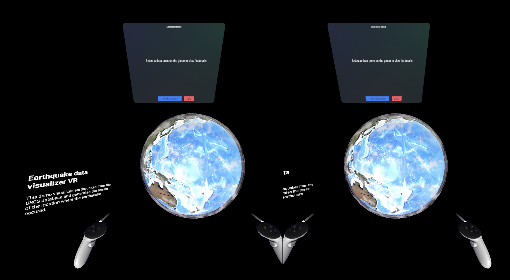
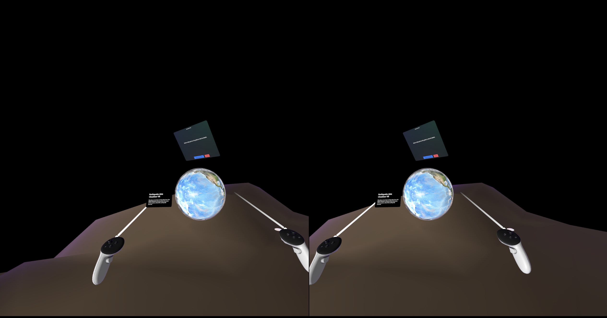
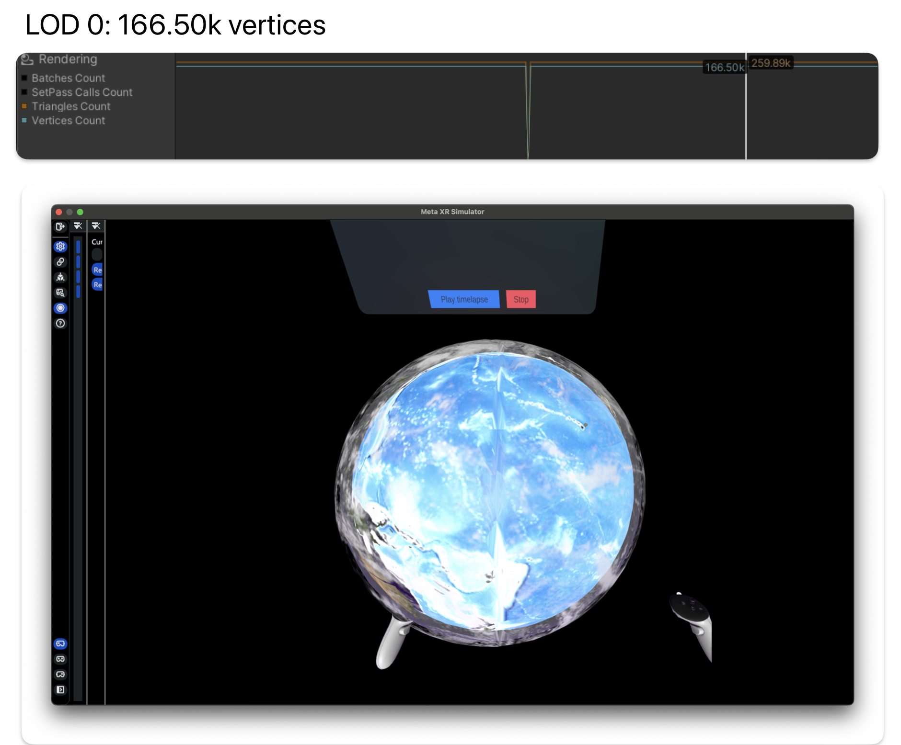
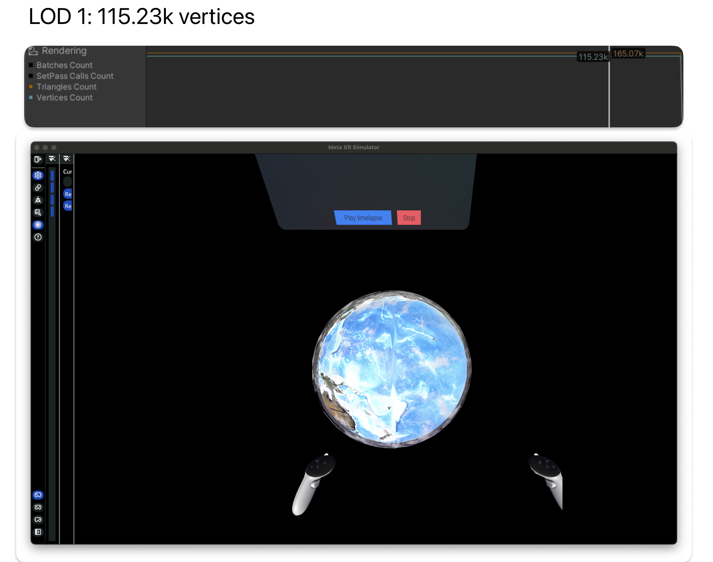
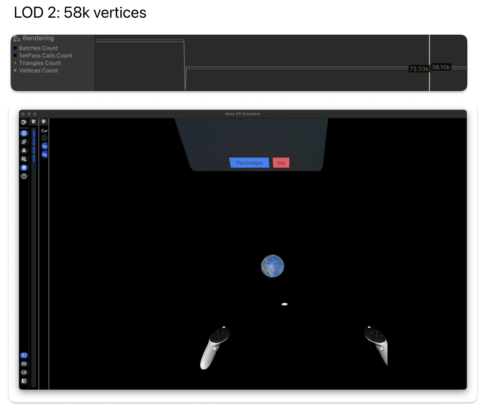
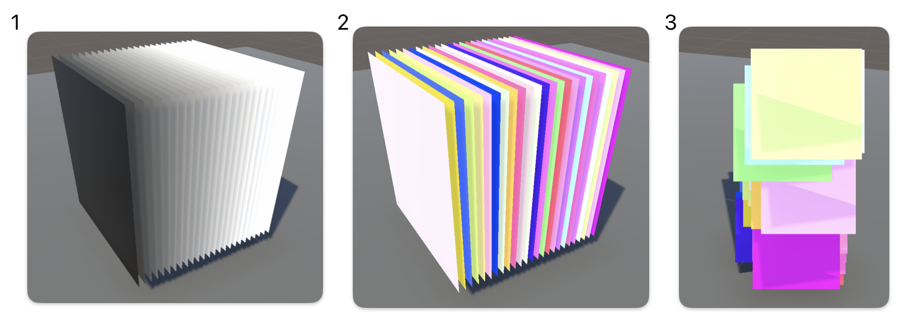

# Earthquake Data Visualization - Unity 2022.3 VR

This project demonstrates visualization of real data using Unity for VR platforms. Fetching from USGS's earthquake database, data points are accurately plotted along spherical coordinates on a globe. This project also demonstrates how to generate terrain given the latitude and longitude of an earthquake location by fetching for the corresponding elevation using the USGS elevation database.

Given the VR platform, it's especially important to keep things performant. We used methods such as batch rendering, mesh simplification, and LODs to balance high detail and performance. 

## Features
- ✅  The system visualizes earthquake data from a specified timeline. 
- ✅  The system plots the data points on a globe based on their location using spherical coordinates. 
- ✅  The system plays a time-lapse animation, showing the data points for each day along the specified timeline. 
- ✅  The system can generate 3D terrain of where the earthquake occurred.
- ✅  The user can scale and rotate the globe using VR controllers.
-  ✅  The user can click on a data point to see more information about the earthquake.

## Technical details
- Must use URP rendering pipeline for VR support.
- Must work on a Meta Quest 2 and 3. 
- Retrieves earthquake data using the USGS earthquake database. 
- Retrieves elevation data for a given coordinate using the USGS elevation database. 

## Installing the APK to a headset

**Prerequisites**
- Meta Quest 2, 3, or Pro
- Meta Quest Developer Hub

NOTE: The app was tested on a Quest 3, but should work on the 2 or Pro as well.

To install app on device:
1. Download [APK]((https://drive.google.com/file/d/1d5pBfKe6ZOGHPAIoEqQI3PC2KX-Xk-hS/view?usp=sharing)) from Google Drive.
2. Set up Meta Quest Developer Hub, if you haven't already. For more information, see 
2. Connect your headset to your local computer and open **Meta Quest Developer Hub**.
3. In the **Device Manager** tab, sdd the APK in the **Apps** panel and install it on your headset.
4. Launch the app.

### Play

In the scene, you'll find a description, a globe with earthquake data points, and a top panel with more details about a selected earthquake.

You can interact with the scene in the following ways: 
- **Look** at data points on the globe. They look like small points with a red flag for visibility. By default, the earthquakes shown are those that occurred on January 1, 2024 and have a magnitude of at least 5.0. 
- **Scale** and **rotate** the globe using the interactable handlers. You'll need to hover your hands close to the globe to find the handlers. 
    - Middle handler: Rotating
    - Top and bottom handler: Scaling
- Press the **Play timelapse** button to see a timelapse of the earthquakes that have occured from January 1, 2024 to May 1, 2024. Press **Stop** to go back to default view.
-  Press the **Show/Hide terrain** button to see the terrain of specific coordinates below you. 
    - NOTE: Due to the grid resolution and number of fetches, it takes a few minutes for the terrain to generate starting from when the app is first launched.

Starting scene:


With generated terrain:


## Setting up for development

**Prequisites**
- Unity 2022.3.23f1

Download the repository by running the following, or a similar command: 
```
git clone https://github.com/chmosquera/Earthquake-Data-Visualization-Unity-VR.git
```
 Or, download the repo as a ZIP.

## About the source project

The main scene is `MainVRExpanded`, which is used in the downloadable APK. 

### Optimizing mesh by using LODs

By using LODs, we can significantly reduce the vertex count of our mesh. It allows us to keep the details when we're near the mesh, and obfuscate them when we're farther away. 

In this demo, we show how this can be used when scaling objects. While the LODs are still camera-based, smaller objects happen naturally get farther away from the camera (unless we bring it closer to us again). This method and the combination of LOD-to-camera settings worked well for handling objects in this demo.






### Particle shader

This is a shader-based particle system based on a [tutorial series](https://www.youtube.com/watch?v=OFgj4cTCMM4&list=PL78XDi0TS4lGMPYs24UZQ3Ox_fU_xsgZS&index=3) taught by Ben Cloward. 

By moving a lot of computation over the GPU, this system is more performant than Unity's built-in particle system. It avoids a lot of expensive CPU tasks and reduces the CPU-to-GPU communication.

Here's a summary of how it works, matching the numbers of the following images. 
1. We load in a mesh that consists of a stack of quads. Each quad will represent a particle. The quads are given vertex colors in gray-scale values, which will be used to create variation in each particle.
2. Using a hash function, we input the color of each vertex, which are all different values by design, and attain a "randomized" Vector 3 value. To demonstrate the new value, we output it as the fragment color.
3. We use the randomized value to adjust numerous properties of the particles. For eaxmple, the position offset.



Particles in the main scene: 
[](https://raw.githubusercontent.com/chmosquera/Earthquake-Data-Visualization-Unity-VR/main/images/demo-particles.mp4)

## Resources and attributes
- https://github.com/Siccity/GLTFUtility
    - Used to load `.gltf` mesh.
- [Unity Mesh Simplifier package](https://github.com/Whinarn/UnityMeshSimplifier/wiki/LOD-Generator-Helper-component)
    - Used to simplify high-poly mesh and generate LOD models.
- [SketchFab Earth model](https://sketchfab.com/3d-models/earth-3874805f5acc48b8a46d57495de53358)
- [Particle System tutorial series](https://www.youtube.com/watch?v=OFgj4cTCMM4&list=PL78XDi0TS4lGMPYs24UZQ3Ox_fU_xsgZS&index=1)
- [Hash algorithm](https://www.bencloward.com/hashcode.txt)
- [Spherical Coordinates in Unity tutorial](https://blog.nobel-joergensen.com/2010/10/22/spherical-coordinates-in-unity/)
- [USGS Earthquake API](https://earthquake.usgs.gov/fdsnws/event/1/)
- [USGS Elevation API](https://epqs.nationalmap.gov/v1/docs)
